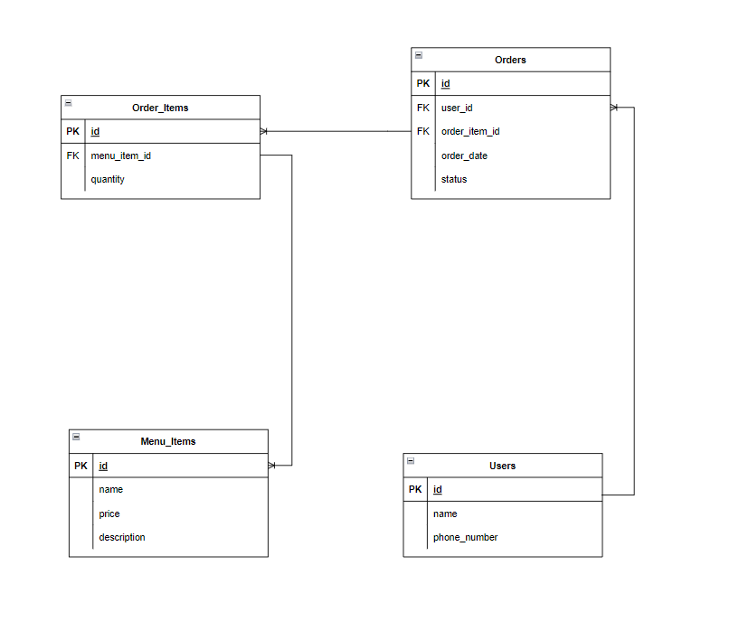

### User Stories

---
 As a user I want to see the menu and add different foods to my cart. 
 As a user i want to be able to edit my cart before confirming my order.
 As the owner, I want to be notified on my phone when an order is made. 
 As the owner, I need to have my own log-in on the web site where I see the pending orders. 
 I need to be able to confirm an order plus say how long until it's ready for the user to see. 
 As the user, I want to see the order status change to 'Order accepted - ready in x minutes' 
 and also get a message to my phone with the same status update.

---

### ERD

---
Users 
- id
- phone_number (will be used as the customer identification and for sms notification)
- name

Orders (all the orders made by the user)
- id 
- user_id
- order_date
- status

Order_Items (a combination of the menu_items selected by the user after clicking check out)
- id
- order_id
- menu_item_id
- quantity

Menu_Items (all the items that make up the menu)
- id
- name
- price
- description

---

### Routes

> #### POST
- /user (handles user account info)
- /order (handles data for the order)

> #### GET
- /  (the front page/ user page)
  
- /order/:phonenumber (shows the order status) API
  
- /admin (For the restaurant owner)

---

---

### Wireframes

---

### Development kits
- Javascript (expressjs, jquery, ajax)
- HTML, CSS (SCSS)
- Database (postgres)

---

user html -
admin html - 
Base layout - Navbar , color-format, button , font, border-format

user css
admin css
viewport css
---

const port = process.env.PORT || 808
