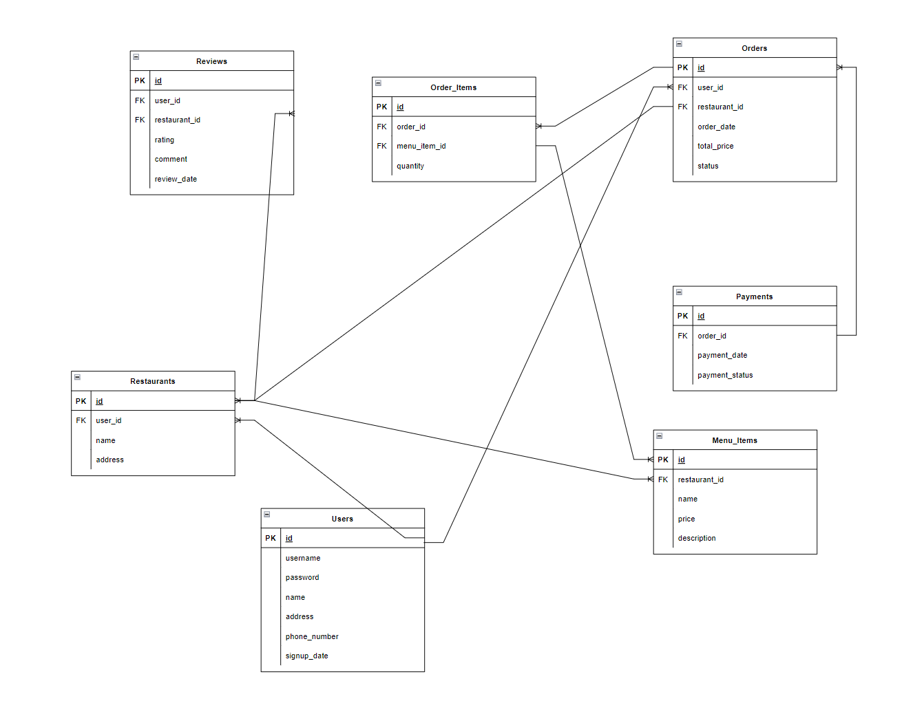

### User Stories

---
- A user should be able to log into their account
- If the user has no account they should be able to signup for an account.
- The users password must be hashed.
- The user is presented with restaurants in their city as soon as they login.
- The user can search for restaurants or restuarants that have a certain item.
- The user will be able to order as many items as the restaurant limits the item orders.
- The user can abort the order process before checkout.
- When the user checkout the order the order is locked and the estimated time of arrival is shown.

---

### ERD

---
Users
- id
- username
- password
- name
- address
- phone_number
- signup_date

Orders
- id 
- user_id
- item_id
- restaurant_id
- number_of_items

Restaurants
- id
- name
- address
- user_id

Items
- id
- description
- price

---

### Routes

---

---

### Wireframes

---